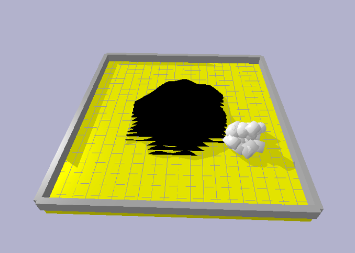
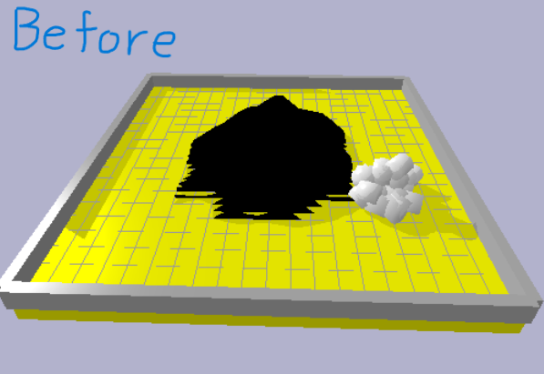
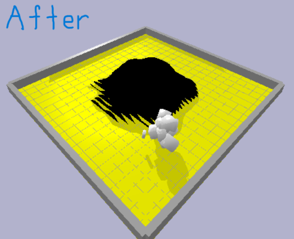
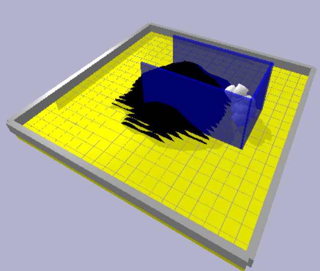

# Evolving Virtual Creatures
**Original Development:** June 2025  
**School Project:** CM3020 Artificial Intelligence  

This project uses a Genetic Algorithm (GA) to evolve the shape and movement of virtual creatures inside a PyBullet physics simulation. The goal was to evolve creatures that could climb a Gaussian pyramid mountain by improving their body structure and control settings.

<figure align="center">
  
  <figcaption>Figure 1: Environment and creature.</figcaption>
</figure>

## Genetic Algorithm Overview
The system iteratively improves a population of creatures through an evolutionary pipeline designed to maintain diversity and prevent premature convergence. 
* **Selection:** Roulette wheel selection (fitness-proportionate)
* **Crossover:** Uniform crossover for diverse genetic combinations.
* **Mutation:** A sequential pipeline of Point, Shrink, and Grow mutations.
* **Elitism:** The highest-fitness creature is preserved across generations.

## The Fitness Function
Fitness is defined by the product of the creature's vertical progress and its proximity to the target center:

$$
Fitness = HeightScore \times CenterScore
$$

* **Height Score:** Ratio of final height to the mountain peak.
* **Center Score:** Euclidean distance from the starting position to the mountain center (0,0).

## Experimental Framework
I conducted a series of controlled experiments to isolate how algorithm configuration influences evolutionary success.

### 1. Parameter Tuning
Modified population size, genome count, mutation rates, and generation cycles. Larger populations (Size 50) and moderate generations (500) provided the best balance. Longer runs often led to reduced diversity rather than better performance.

### 2. Encoding Scheme & Size Limits
To prevent "fitness hacking" (where creatures evolved massive sizes to "lean" on the mountain for height), I implemented strict morphological constraints:

* Link Length: 0.2 – 1.0 units
* Link Radius: 0.1 – 0.5 units
* Result: While raw fitness scores decreased, the creatures exhibited more realistic, agile adaptations.

<table align="center">
  <tr>
    <td align="center">
       
      <b>Figure 2:</b> Large "hacking" creatures.
    </td>
    <td align="center">
       
      <b>Figure 3:</b> Realistic, agile adaptations.
    </td>
  </tr>
</table>

### 3. Motor Settings (Actuation Control)
Tested the relationship between Control-Amplitude (range of motion) and Control-Frequency (speed). A combination of 0.5 Amp and 2.0 Freq achieved the highest fitness. Extreme values (Run 28) caused total population collapse ($Fitness = 0$), highlighting the sensitivity of physics-based evolution.

## Detailed Results Summary

| Run ID | Pop Size | Genome Size | Mutation Rate | Generations | Best Fitness |
| :--- | :--- | :--- | :--- | :--- | :--- |
| **1 (Baseline)** | 20 | 10 | 0.2 | 300 | 0.1273 |
| **3 (Optimized)** | 50 | 10 | 0.2 | 300 | 0.5555 |
| **10 (High Mut)** | 20 | 10 | 0.4 | 300 | 0.3860 |
| **14 (Size Limit)** | 50 | 5 | 0.4 | 500 | 0.1524 |

Visual inspection revealed that many top-performing creatures utilized "rotation-based height" rather than true climbing. This indicated a fundamental limitation in the simple fitness function, which prioritized absolute Z-height over directional locomotion.

## Environmental Manipulation
To test whether changing the environment could help guide evolution, I added translucent bumpers next to the mountain to act as simple physical guides. The idea was that these bumpers would stop creatures from falling off the sides and push them to stay on a path that leads upward.

<figure align="center">
  
  <figcaption>Figure 4: Environmental barriers implementation.</figcaption>
</figure>

**Result:** The bumpers did not increase performance (Run 30 Fitness: 0.0575 compared to Run 29 without bumpers: 0.0703).

**Insight:** After watching the simulations, it was clear that most creatures stayed near the base of the mountain. Because they had not yet evolved the basic motor ability to move upward, the bumpers were mostly never used. This suggests that the main problem was not the environment itself, but the creatures’ behavior and movement abilities.

## Conclusion
This project shows how difficult it can be to evolve coordinated behavior in a physics-based simulation. Although changing parameters and adjusting the environment can help slightly, the Fitness Function and the Encoding Scheme are still the most important parts of the system. The experiments showed that the way fitness is measured and how the creatures are encoded has a much bigger effect on the results than simple parameter changes.

One important lesson from this project is the idea of fitness hacking. If there are no proper limits in the system, evolution will usually find the easiest way to get a high score instead of showing the behavior that was intended. For example, some creatures evolved by simply growing taller so they could lean against the mountain rather than actually climbing it. This shows that the design of the fitness function must be carefully considered so that it rewards the correct type of behavior.

Another key lesson is that behavior matters more than the environment. Adding physical guides such as bumpers did not significantly improve performance because the creatures had not yet developed the basic motor skills needed to move upward. Since they stayed near the base of the mountain, the bumpers were rarely used. This suggests that improving control and movement abilities is more important than modifying the environment in early stages of evolution.

Finally, the population collapse seen in Run 28 showed the importance of good data persistence and logging. Without detailed records of each generation, it is difficult to understand why evolution fails or reaches a dead end. Keeping logs of population data and fitness values would make it easier to debug the system and analyze failures in future experiments.